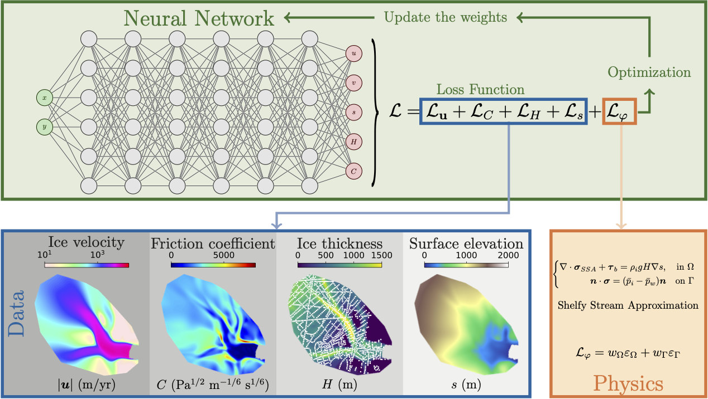

# PINNICLE
Physics Informed Neural Networks for Ice and CLimatE

A Python library for solving ice sheet modeling problems using a unified framework with Physics Informed Neural Networks

---
**NOTE**

   This project is under active development.

---

**Documentation**: [pinnicle.readthedocs.io](https://pinnicle.readthedocs.io)

## Physics

- Momentum Conservation (stress balance):
  - Shelfy Stream Approximation (SSA)
  - MOno-Layer Higher-Order (MOLHO) ice flow model

- Mass Conservation (mass balance):
  - Thickness evolution

- Coupuling:
  - stress balance + mass balance

- Time dependent problems

## Data format

- [ISSM](https://issm.jpl.nasa.gov) `model()` type, directly saved from ISSM by `saveasstruct(md, filename)`
- Scattered data

## More

- [Install and Setup](https://pinnicle.readthedocs.io/en/latest/installation.html#installation)
- [An example of stress balance](https://pinnicle.readthedocs.io/en/latest/examples/ssa.html)

