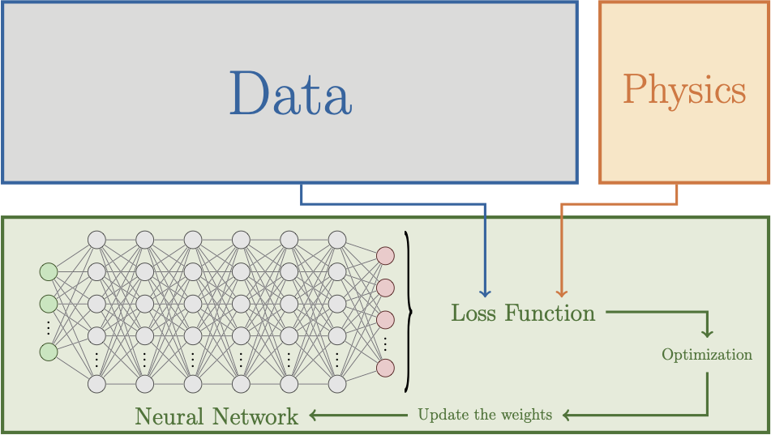

# PINNICLE: Physics-Informed Neural Networks for Ice and CLimatE

[](https://pypi.org/project/PINNICLE/)
[](https://github.com/ISSMteam/PINNICLE/actions/workflows/CI.yml)
[](https://codecov.io/gh/ISSMteam/PINNICLE)
[](https://pinnicle.readthedocs.io/en/latest/?badge=latest)
[](https://doi.org/10.5281/zenodo.15437985)
[](https://pypi.org/project/PINNICLE/)
[](https://pypi.org/project/PINNICLE/)

**PINNICLE** (Physics-Informed Neural Networks for Ice and CLimatE) is an open-source Python library for modeling ice sheets using physics-informed neural networks.
It is designed to integrate physical laws with observational data to solve both forward and inverse problems in glaciology.
The library currently supports stress balance approximations, mass conservation, and time-dependent simulations, etc. Built on top of [DeepXDE](https://github.com/lululxvi/deepxde), it supports TensorFlow, PyTorch, and JAX backends.

Developed at the Department of Earth Sciences, Dartmouth College, USA.



---

## 🚀 Features

- Solve forward and inverse glaciological problems
- Built-in support for:
  - Shelfy-Stream Approximation (SSA)
  - Mono-Layer Higher-Order (MOLHO) stress balance
  - Time-dependent mass conservation
- Support for multiple backends: TensorFlow, PyTorch, JAX
- Integration with observational data: [ISSM](https://issm.jpl.nasa.gov) data format, MATLAB general `.mat`, HDF5, NetCDF.
- Fourier Feature Transform for input and output
- Fully modular and customizable architecture


## 📦 Installation

### Install from PyPI (recommended)

```bash
pip install pinnicle
```

### Install from source

```bash
git clone https://github.com/ISSMteam/PINNICLE.git
cd PINNICLE
pip install -e .
```
### Dependencies

PINNICLE requires:

* Python ≥ 3.9
* [DeepXDE](https://github.com/lululxvi/deepxde)
* NumPy, SciPy, pandas, matplotlib, scikit-learn
* mat73 (for MATLAB v7.3 files)

## ⚙️ Backend Selection

PINNICLE supports TensorFlow, PyTorch, and JAX backends via DeepXDE.

Choose your backend:

```bash
DDE_BACKEND=tensorflow python your_script.py
```

You can also export the backend globally (Linux/macOS):

```bash
export DDE_BACKEND=pytorch
```

Alternatively, edit `~/.deepxde/config.json`:

```json
{
  "backend": "tensorflow"
}
```

## 🧪 Examples

Example scripts and input files are located in the [`examples/`](https://github.com/ISSMteam/PINNICLE/tree/main/examples) directory.

* [**Example 1**](https://github.com/ISSMteam/PINNICLE/blob/main/examples/example1_helheim_ssa_inverse.py):
  Inverse problem on Helheim Glacier using SSA to infer basal friction

* [**Example 2**](https://github.com/ISSMteam/PINNICLE/blob/main/examples/example2_pig_ssa_rheology.py):
  Joint inversion of basal friction and ice rheology for Pine Island Glacier

* [**Example 3**](https://github.com/ISSMteam/PINNICLE/blob/main/examples/example3_helheim_forward_transient.py):
  Time-dependent forward modeling of Helheim Glacier (2008–2009)

Each example includes a complete Python script and configuration dictionary.


## 📖 Documentation

Full documentation is available in the `docs/` folder or at:

📘 [pinnicle.readthedocs.io](https://pinnicle.readthedocs.io)


## 📚 Citation

If you use PINNICLE in your research, please cite:

> Cheng, G., Krishna, M., and Morlighem, M.: A Python library for solving ice sheet modeling problems using Physics Informed Neural Networks, PINNICLE v1.0, EGUsphere [preprint], https://doi.org/10.5194/egusphere-2025-1188, 2025.

**BibTeX**:

```bibtex
@Article{egusphere-2025-1188,
   AUTHOR = {Cheng, G. and Krishna, M. and Morlighem, M.},
   TITLE = {A Python library for solving ice sheet modeling problems using Physics Informed Neural Networks, PINNICLE v1.0},
   JOURNAL = {EGUsphere},
   VOLUME = {2025},
   YEAR = {2025},
   PAGES = {1--26},
   URL = {https://egusphere.copernicus.org/preprints/2025/egusphere-2025-1188/},
   DOI = {10.5194/egusphere-2025-1188}
}
```

---

## 📂 License

This project is licensed under the [GNU Lesser General Public License v2.1](LICENSE).

---

## 🤝 Acknowledgements

Supported by:

* National Science Foundation \[#2118285, #2147601]
* Novo Nordisk Foundation \[NNF23OC00807040]
* Heising-Simons Foundation \[2019-1161, 2021-3059]

---

## 🔗 Links

* 📦 PyPI: [pinnicle](https://pypi.org/project/pinnicle/)
* 📖 Documentation: [pinnicle.readthedocs.io](https://pinnicle.readthedocs.io)
* 📄 Zenodo Archive: [doi.org/10.5281/zenodo.15178900](https://doi.org/10.5281/zenodo.15178900)

