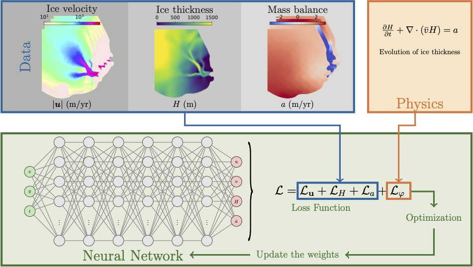

.. _example3:

Time-Dependent Forward Modeling of Helheim Glacier
==================================================

This example demonstrates how to use PINNICLE for solving a **time-dependent forward problem**, simulating the evolution of ice thickness over time using the mass conservation equation. The case study focuses on **Helheim Glacier, Greenland**, over the period **2008–2009**.

|

Problem Description
-------------------

We solve the `Mass Conservation <../physics/mass.html>`_
The goal is to simulate how ice thickness evolves over time, given velocity and mass balance data as a time series. This is a **forward modeling** problem with known initial conditions.

.. math::

   \frac{\partial H}{\partial t} + \nabla \cdot (\bar{\mathbf{u}} H) = a

where:

- :math:`H` is ice thickness
- :math:`\bar{\mathbf{u}} = (u, v)^T` is the depth-averaged horizontal velocity
- :math:`a` is the net surface mass balance

Data and Setup
--------------

Data are provided as `.mat` files (one per time step), derived from a transient ISSM simulation. Each file contains velocity, mass balance, and (for the initial step) thickness.

- **Time Range**: 2008–2009 (with 11 time steps, every 0.1 years)
- **Inputs**: :math:`u`, :math:`v`, :math:`a` at each time step
- **Initial condition**: :math:`H` at :math:`t = 2008`

PINNICLE automatically constructs the spatiotemporal domain and trains a network to model :math:`H(x, y, t)`.

Configuration Snippet
---------------------

.. code-block:: python

   hp["time_dependent"] = True
   hp["start_time"] = 2008
   hp["end_time"] = 2009
   hp["num_layers"] = 6
   hp["num_neurons"] = 32
   hp["equations"] = {"Mass transport": {}}
   hp["shapefile"] = "Helheim_Basin.exp"
   hp["num_collocation_points"] = 10000

   for t in np.linspace(2008, 2009, 11):
       issm = {}
       if t == 2008:
           issm["data_size"] = {"u":3000, "v":3000, "a":3000, "H":3000}
       else:
           issm["data_size"] = {"u":3000, "v":3000, "a":3000, "H":None}
       issm["data_path"] = f"Helheim_Transient_{t}.mat"
       issm["default_time"] = t
       issm["source"] = "ISSM"
       hp["data"][f"ISSM{t}"] = issm

Loss Function
-------------

The total loss includes:

.. math::

   L = L_u + L_H + L_a + L_\phi

where:
- :math:`L_u`: data misfit for velocity across all time steps
- :math:`L_H`: initial thickness misfit at :math:`t = 2008`
- :math:`L_a`: mass balance misfit across time
- :math:`L_\phi`: mass conservation residual at spatiotemporal collocation points

Results
-------

After training for 800,000 epochs, the solution at the initial and final time steps are

|

The top rows show the “true” simulation output from ISSM, the middle rows show PINNICLE predictions, and the bottom rows show misfits.

References
----------

- Cheng et al. (2022). "Helheim Glacier’s Terminus Position Controls Its Seasonal and Inter-Annual Ice Flow Variability"
- Cheng et al. (2024). "Forward and Inverse Modeling of Ice Sheet Flow Using Physics-Informed Neural Networks"

Complete code
-------------

.. literalinclude:: ../../examples/example3_Helheim_Transient/example3.py
  :language: python

