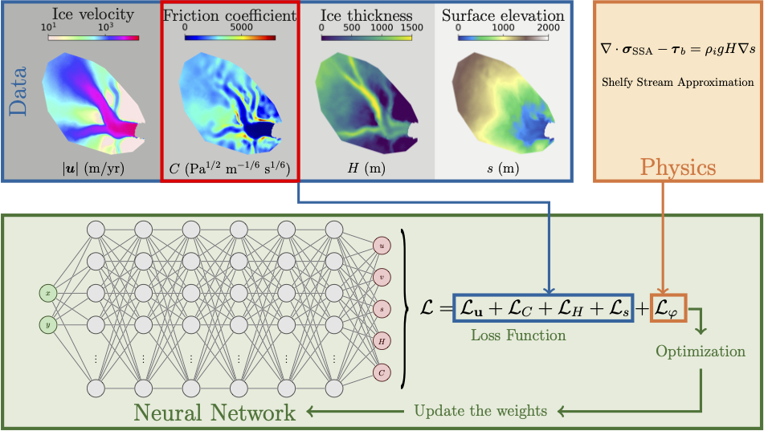
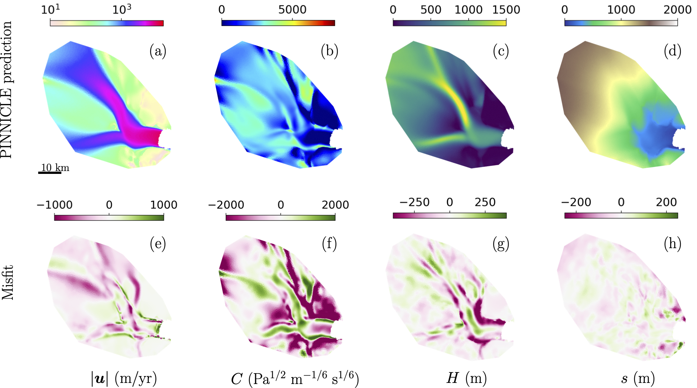

.. _example1:

Inverse Problem on Helheim Glacier
==================================

This example illustrates PINNICLE’s ability to solve a classical **inverse problem** in glaciology: inferring the **basal friction coefficient** from surface observations using the `Shelfy-Stream Approximation (SSA) <../physics/momentum.html>`_  model.

The case study is based on **Helheim Glacier**, located in Southeast Greenland.

|

Problem Description
-------------------

The task is to infer the spatially varying basal friction coefficient :math:`C(x, y)` by minimizing the misfit between model and observed ice surface velocity (:math:`u`, :math:`v`)
The governing equations are the SSA momentum balance equations, with basal friction modeled by Weertman’s law:

.. math::

   \nabla \cdot \sigma_{\text{SSA}} - \tau_b = \rho_i g H \nabla s

.. math::

   \tau_b = C^2 {|\mathbf{u}|}^{m-1}\mathbf{u}

Configuration
-------------

The problem is configured using:

.. code-block:: python

   hp["epochs"] = 100000
   hp["num_layers"] = 6
   hp["num_neurons"] = 20
   hp["shapefile"] = "Helheim.exp"
   hp["num_collocation_points"] = 9000
   hp["equations"] = {"SSA": {}}

Data is provided from an ISSM model output in :code:`Helheim.mat`:

.. code-block:: python

   issm = {
       "data_path": "Helheim.mat",
       "data_size": {"u": 4000, "v": 4000, "s": 4000, "H": 4000, "C": None}
   }
   hp["data"] = {"ISSM": issm}

Setting :code:`"C": None` means that basal friction should be treated as an Dirichlet boundary condition and the interior is inferred by PINNICLE.
Indeed, if the keyword :code:`"C"` is not even mentioned in :code:`"data_size"`, then it will be treated as an unknown, and inferred completely by PINNICLE.

Loss Function
-------------

The total loss includes:

.. math::

   L = L_u + L_H + L_s + L_C + L_\phi

where:
- :math:`L_u`: misfit of velocity (x and y components)
- :math:`L_H`: misfit of ice thickness
- :math:`L_s`: misfit of surface elevation
- :math:`L_C`: Dirichlet boundary condition constraint on :math:`C`
- :math:`L_\phi`: residual of the SSA equations (physical loss)

Each term is weighted appropriately using PINNICLE's default weights.

Results
-------

|

- First row: PINNICLE predictions
- Second row: misfit compared to the data and eference solution

References
----------

- Cheng et al. (2024). "Forward and Inverse Modeling of Ice Sheet Flow Using Physics-Informed Neural Networks"
- MacAyeal, D. R. (1989). "Large-scale ice flow over a viscous basal sediment"
- Weertman, J. (1957). "On the sliding of glaciers"

Complete code
-------------

.. literalinclude:: ../../examples/example1_Helheim_inverse/example1.py
  :language: python

