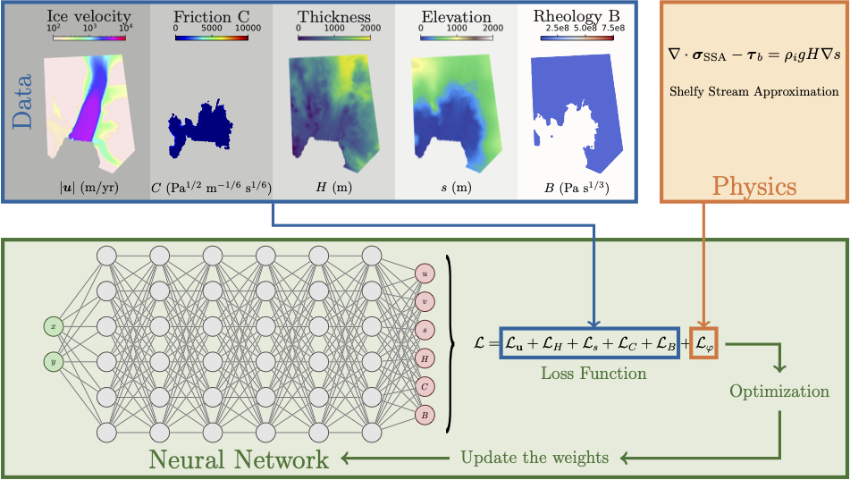
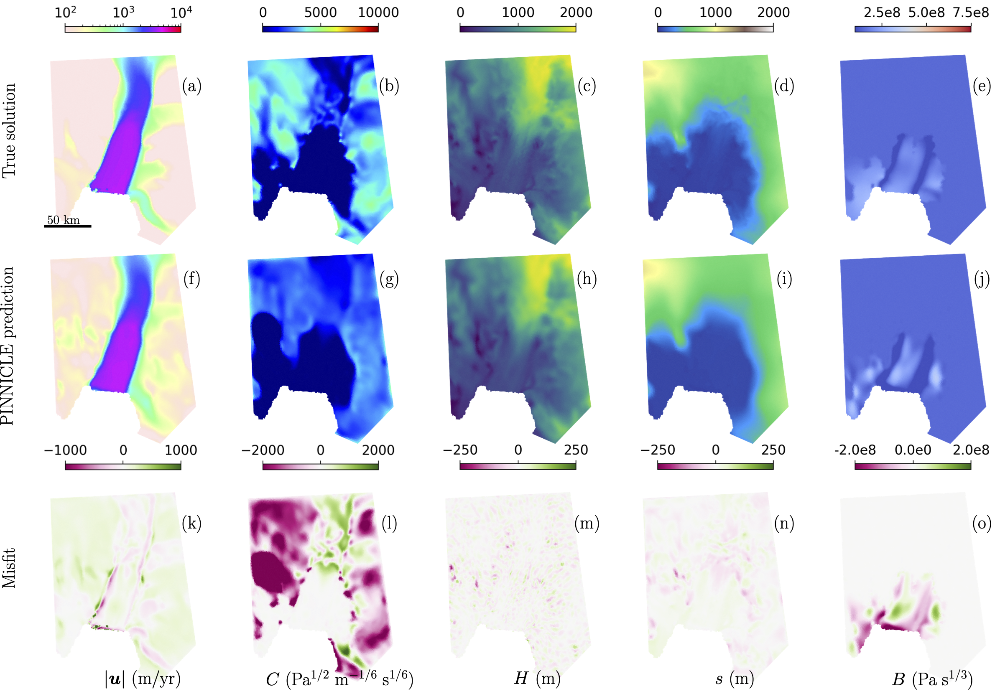

.. _example2:

Simultaneous Inference of Basal Friction and Ice Rheology
=========================================================

This example showcases PINNICLE’s ability to solve **multi-parameter inverse problems**, where both **basal friction** and **ice rheology** are simultaneously inferred from observational data, using the `Shelfy-Stream Approximation (SSA) <../physics/momentum.html>`_  model. The case study uses real geometry from **Pine Island Glacier (PIG), Antarctica**.

|

Problem Description
-------------------

The goal is to infer two spatially varying parameters:

- **Basal friction coefficient** (:math:`C`) beneath grounded ice
- **Rheology pre-factor** (:math:`B`) within the floating ice shelf

The problem is solved using the `SSA <../physics/momentum.html>`_ with Glen's flow law, expressed as:

.. math::

   \nabla \cdot \sigma_{\text{SSA}} - \tau_b = \rho_i g H \nabla s

with:

- :math:`\sigma_{\text{SSA}}`: stress tensor
- :math:`\tau_b = C^2 |\mathbf{u}|^m`: basal friction (Weertman law)

The stress tensor is defined as

.. math::

   \sigma_{\text{SSA}} =
   \mu H\begin{bmatrix}
   4 \frac{\partial u}{\partial x} + 2\frac{\partial v}{\partial y} &  \frac{\partial u}{\partial y} +  \frac{\partial v}{\partial x} \\
     \frac{\partial u}{\partial y} +  \frac{\partial v}{\partial x} & 2\frac{\partial u}{\partial x} + 4\frac{\partial v}{\partial y}
   \end{bmatrix}

where the viscosity :math:`\mu` is 

.. math::

   \mu = \frac{B}{2}
   \left[
   \left( \frac{\partial u}{\partial x} \right)^2
   +
   \left( \frac{\partial v}{\partial y} \right)^2
   +
   \frac{1}{4} \left( \frac{\partial u}{\partial y} + \frac{\partial v}{\partial x} \right)^2
   +
   \frac{\partial u}{\partial x} \frac{\partial v}{\partial y}
   \right]^{\frac{1-n}{2n}}

where :math:`B` is a spatially varying pre-factor.

Configuration
-------------

The domain is larger than the examples of `Helheim Glacier <./Helheim_inverse_SSA.html>`_ and uses more data and collocation points to ensure adequate resolution.
We use :code:`"SSA_VB"` equation to account for spatial dependent pre-factor :math:`B`.

.. code-block:: python

   hp["epochs"] = 1000000
   hp["num_layers"] = 6
   hp["num_neurons"] = 40
   hp["fft"] = True
   hp["sigma"] = 10
   hp["num_fourier_feature"] = 30
   hp["shapefile"] = "PIG.exp"
   hp["num_collocation_points"] = 18000
   hp["equations"] = {"SSA_VB": {}}

We also need to set, as boundary conditions, for the pre-factor :math:`B` to constant :math:`1.41 \times 10^8 \ \text{Pa s}^{1/3}` on the grounded ice and friction coefficient :math:`C=0` for the floating ice:

.. code-block:: python

   hp["data"] = {
       "ISSM": {
           "data_path": "PIG.mat",
           "data_size": {"u": 8000, "v": 8000, "s": 8000, "H": 8000}
       },
       "BC": {
           "data_path": "BC.mat",
           "data_size": {"C": 4000, "B": 4000},
           "source": "mat"
       }
   }

Loss Function
-------------

The total loss includes:

.. math::

   L = L_u + L_H + L_s + L_C + L_B + L_\phi

where:

- :math:`L_u, L_H, L_s`: data misfit terms for velocity, thickness, surface elevation
- :math:`L_C, L_B`: boundary condition for basal friction and rheology
- :math:`L_\phi`: PDE residual from SSA equations

Results
-------

After 1,000,000 epochs, PINNICLE infers the following:

|

- First row: reference "true solution" (from ISSM)
- Second row: PINNICLE predictions
- Third row: misfit between prediction and reference

References
----------

- Cheng et al. (2024). "Forward and Inverse Modeling of Ice Sheet Flow Using Physics-Informed Neural Networks"

Complete code
-------------

.. literalinclude:: ../../examples/example2_PIG/example2.py
  :language: python
