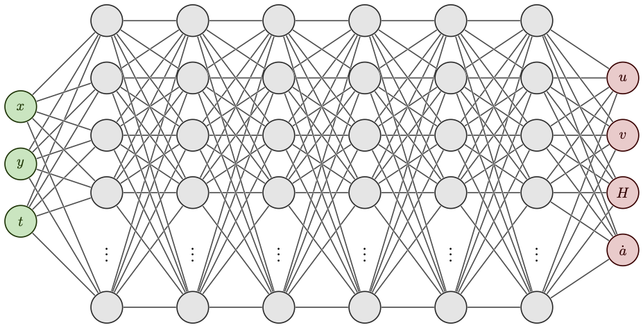

.. _neural_network:

Neural Network Architecture
===========================

PINNICLE supports two types of neural network architectures:

1. **Fully Connected Neural Network (FNN)**  
   Default architecture used in most problems. All output variables are predicted jointly by a single neural network.

2. **Parallel Fully Connected Neural Networks (PFNN)**  
   Each dependent variable is predicted by its own sub-network. Useful when the relationships among variables are too complex to be learned jointly.

FNN (Default)
~~~~~~~~~~~~~

- One input layer (e.g., :math:`x, y, t`)
- Multiple hidden layers with activation functions
- One output layer (e.g., :math:`u, v, H, C`)

PFNN
~~~~

- One network per output variable
- Shared inputs across all sub-networks
- Useful for ill-conditioned or weakly coupled systems

Configuration
-------------

The neural network is configured using the following parameters in the `hp` dictionary:

.. code-block:: python

   hp["num_layers"] = 6             # Number of hidden layers
   hp["num_neurons"] = 32           # Number of neurons per layer
   hp["activation"] = "tanh"        # Activation function (default is tanh)
   hp["architecture"] = "FNN"

You can also set each layers with different number of neurons:

.. code-block:: python

   hp["num_layers"] = 6
   hp["num_neurons"] = [128, 128, 64, 32, 32, 32, 16]

For PFNN, :code:`"num_layers"` is the total number of layers, **including** the input and output layer, therefore, to have different number of neurons, you only need to define for the hidden layers

.. code-block:: python

   hp["architecture"] = "PFNN"
   hp["num_layers"] = 6
   hp["num_neurons"] = [64, 32, 32, 16]   # only 6-2=4 hidden layers each

Activation Functions
--------------------

The default activation is the hyperbolic tangent (:code:`"tanh"`), which works well in many physical applications. You can change it to:

- :code:`"ReLU"`
- :code:`"sin"`
- :code:`"Sigmoid"`
- :code:`"Swish"`
- or custom activations from TensorFlow, PyTorch, or JAX

Input/Output Mapping
--------------------

- **Inputs**: spatial (:math:`x, y`) and temporal (:math:`t`) coordinates ( if :code:`hp["time_dependent"] = True`)
- **Outputs**: dependent PDE variables (e.g., :math:`u, v, H, s, C, B`)

PINNICLE automatically constructs the mapping between inputs and outputs based on the specified physics model and user data.

Normalization
-------------

By default:

- Inputs are min–max normalized
- Outputs are de-normalized to original units based on the data and typical values. The typical values of the lower and upper bounds of the variables are pre-defined in :py:mod:`pinnicle.physics.constants`

You do not need to manually scale physical quantities; PINNICLE handles this automatically.

Parallelization and Backends
----------------------------

PINNICLE is built on **DeepXDE**: `https://github.com/lululxvi/deepxde <https://github.com/lululxvi/deepxde>`_, which supports the following ML frameworks:

- **TensorFlow**
- **PyTorch**
- **JAX**

You can choose a backend following the instruction in :ref:`installation<backends>`.
